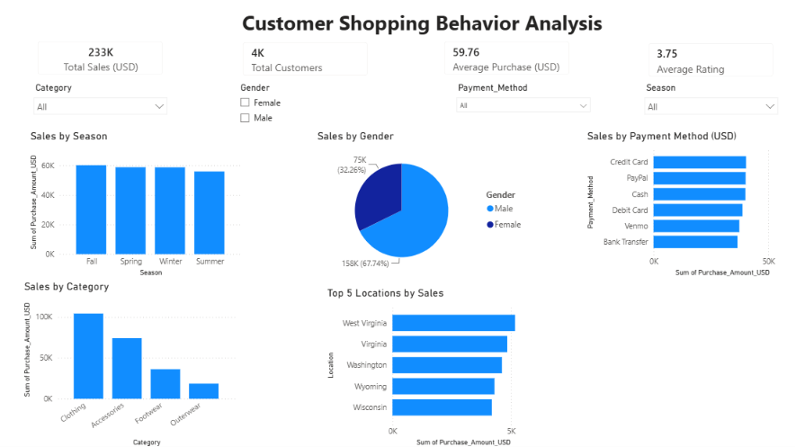

# 🛍️ Customer Shopping Behavior Analysis Dashboard

An end-to-end **Data Analytics Project** built using **SQL Server, Power BI, DAX, Excel, and Python** to analyze customer shopping behavior and provide interactive business insights.

---

# 📊 Dashboard Preview



---

# 📌 Project Overview

This project analyzes customer shopping data to uncover insights into purchasing behavior, customer demographics, seasonal sales trends, preferred payment methods, and top-performing locations.

The interactive Power BI dashboard enables users to filter data dynamically using slicers and monitor key business metrics through KPI cards.

---

# 🎯 Objectives

- Analyze customer purchase behavior.
- Identify top-selling product categories.
- Compare sales across different seasons.
- Analyze customer distribution by gender.
- Evaluate preferred payment methods.
- Identify top-performing locations.
- Build an interactive dashboard using Power BI and DAX.

---

# 🛠️ Tech Stack

- **SQL Server** – Data querying and analysis
- **Power BI Desktop** – Interactive dashboard creation
- **DAX** – KPI calculations and measures
- **Microsoft Excel** – Data exploration and validation
- **Python (Pandas & Matplotlib)** – Exploratory Data Analysis (EDA) and visualization
- **Git & GitHub** – Version control

---

# 📂 Project Structure

```text
Customer_Shopping_Behavior_Analysis/
│
├── Dataset/
│   └── shopping_trends_updated.csv
│
├── SQL/
│   └── customer_shopping_analysis.sql
│
├── Excel/
│   └── Customer_Shopping_Dashboard.xlsx
│
├── PowerBI/
│   └── Customer_Shopping_Behavior_Analysis.pbix
│
├── Python/
│   ├── customer_analysis.py
│   └── charts/
│
├── Images/
│   └── dashboard.png
│
├── .gitignore
└── README.md
```

---

# 📈 Dashboard KPIs

- 💰 Total Sales
- 👥 Total Customers
- 💵 Average Purchase Value
- ⭐ Average Customer Rating

---

# 📊 Dashboard Visualizations

- Sales by Category
- Sales by Season
- Sales by Gender
- Sales by Payment Method
- Top 5 Locations by Sales

---

# 🎛️ Interactive Filters

- Category
- Gender
- Payment Method
- Season

---

# 🔍 Key Insights

- Clothing generated the highest overall sales among all product categories.
- Male customers contributed a larger share of total sales.
- Sales remained relatively consistent across all four seasons.
- Credit Card and PayPal were among the most preferred payment methods.
- West Virginia recorded the highest sales among the top five locations.

---

# 🚀 How to Run the Project

### 1. Clone the repository

```bash
git clone https://github.com/alishaapinto/customer-shopping-behavior-analysis.git
```

### 2. Open the Power BI dashboard

```
PowerBI/Customer_Shopping_Behavior_Analysis.pbix
```

### 3. Explore the dashboard using the interactive slicers to analyze customer shopping behavior.

---

# 📚 Skills Demonstrated

- SQL Queries
- Data Cleaning
- Exploratory Data Analysis (EDA)
- Data Visualization
- Dashboard Design
- DAX Measures
- Business Intelligence
- Microsoft Excel
- Python (Pandas & Matplotlib)
- Git & GitHub

---

# 👩‍💻 Author

**Alisha Pinto**

**GitHub:** https://github.com/alishaapinto

**Repository:** https://github.com/alishaapinto/customer-shopping-behavior-analysis

---

## ⭐ Support

If you found this project helpful, consider giving it a **⭐ Star** on GitHub!
